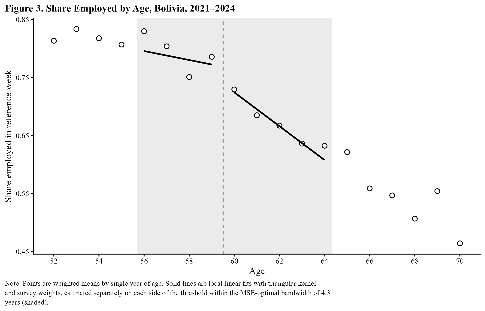
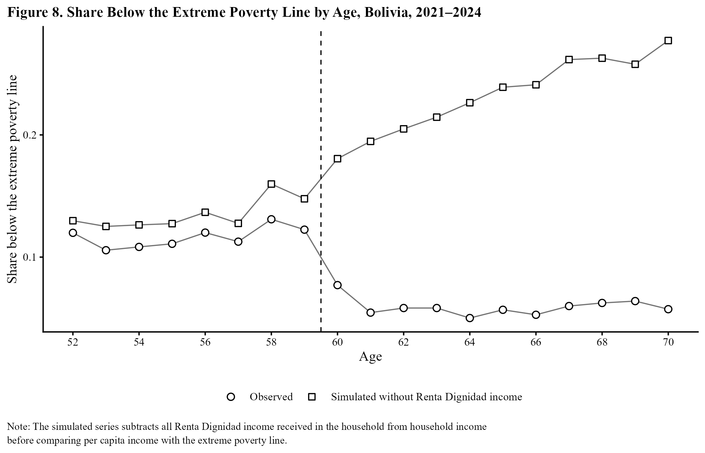

# Renta Dignidad and Retirement: A Regression Discontinuity Analysis

Does a universal old-age pension push people out of work? This project estimates the effects of Bolivia's **Renta Dignidad**, a monthly transfer paid to nearly every resident aged 60 and older, on non-labor income, employment, and poverty. It uses a regression discontinuity design at the age-60 eligibility threshold and four years of Bolivia's national household survey (Encuesta de Hogares, 2021–2024; 40,015 respondents aged 45–75).

**Full paper:** [Income Without Retirement? Renta Dignidad, Poverty, and Employment at Age 60 in Bolivia (PDF)](paper/Renta_Dignidad_Analisis.pdf)

## Key findings

- **Income.** Eligibility raises monthly non-labor income by about **Bs 308** at age 60, most of it the transfer itself (Bs 267).
- **Employment.** Employment falls by **4.0 percentage points** at 60, but the estimate is not statistically significant (p = 0.160; honest 95% CI −10.2 to +1.0).
- **A competing threshold.** The decline is concentrated among workers with 7+ years of schooling (−16.6 pp), the group whose contributory pension receipt rises steeply from age 58. Excluding contributory pension recipients cuts the full-sample estimate by 56%.
- **Salary rule.** Renta Dignidad excludes people drawing a salary, yet salaried employment shows no discontinuity at 60.
- **Poverty.** Extreme poverty falls by **5.6 percentage points**. Removing Renta Dignidad income from households eliminates the drop, so the reduction comes from the transfer itself, with no offsetting behavioral response.

**Bottom line:** the program's clearest effects are on household income and poverty. The evidence that it induces retirement at 60 is weak and hard to separate from Bolivia's contributory pension system.

<p align="center">
  
  
</p>

## Repository structure

```
renta-dignidad-rd/
├── run_all.R              Installs packages and runs the full pipeline
├── R/
│   ├── 01_data.R          Reads and harmonizes the four survey years; builds variables
│   ├── 02_functions.R     Estimation helpers (robust RD, honest RD, local randomization)
│   ├── 03_analysis.R      Runs every estimate; saves CSVs and results.rds
│   ├── 04_figures.R       Figures 1–8
│   └── 05_tables.R        Tables 1–11
├── paper/                 Full paper (PDF)
├── data/                  Survey files go here (not included; see below)
└── output/
    ├── figures/           PNG figures (300 dpi)
    ├── tables/            PNG tables (300 dpi)
    └── csv/               Every estimate with SE, CI, p-value, bandwidth and N
```

## Data

The microdata are published by Bolivia's Instituto Nacional de Estadística (INE) and are not redistributed here. Download the person-level SPSS files (`Personas`) for each year from INE's data catalog:

| Year | Catalog |
|------|---------|
| 2021 | https://anda.ine.gob.bo/index.php/catalog/93 |
| 2022 | https://anda.ine.gob.bo/index.php/catalog/106 |
| 2023 | https://anda.ine.gob.bo/index.php/catalog/108 |
| 2024 | https://anda.ine.gob.bo/index.php/catalog/163 |

Save them in `data/` as `EH2021_Personas.sav`, `EH2022_Personas.sav`, `EH2023_Personas.sav` and `EH2024_Personas.sav`.

## How to run

Requirements: **R 4.5 or newer** (needed by RDHonest) and, to match the figure style, the free [DejaVu Serif](https://dejavu-fonts.github.io/) font. To use a system font instead, change `font <- "DejaVu Serif"` in `run_all.R` to `"Times New Roman"` or `"serif"`.

```r
setwd("path/to/renta-dignidad-rd")
source("run_all.R")
```

The first run installs the required packages. After that, a full run takes about one minute and regenerates everything in `output/`.

Packages: `haven`, `dplyr`, `tidyr`, `purrr`, `readr`, `ggplot2`, `ragg`, `rdrobust`, `rddensity`, `RDHonest`, `sandwich`, `lmtest`.

## Methods

- **Design.** Sharp RD at age 60, estimated by local linear regression with a triangular kernel, survey weights (`Factor_Rev2025`) and the MSE-optimal bandwidth of Calonico, Cattaneo and Titiunik (2014). Standard errors are clustered by primary sampling unit.
- **Discrete running variable.** Age is recorded in whole years, so results are also reported with honest confidence intervals (Armstrong and Kolesár 2020), a local randomization comparison of ages 59 and 60, and a donut specification.
- **Robustness.**
  - fuzzy RD using reported receipt as the treatment
  - year fixed effects and covariate adjustment
  - one-sided placebo cutoffs
  - covariate balance tests
  - density and heaping tests
  - bandwidth sensitivity
- **Mechanisms.**
  - decomposition of the first stage into transfer and pension income
  - employment by type of work (salaried, self-employed, public sector)
  - subgroup estimates with formal difference tests
  - estimates excluding contributory pension recipients
  - poverty simulated without Renta Dignidad income
  - household composition

## Author

Diego Farfan, Economics, University of Kentucky (Gatton College of Business and Economics)
